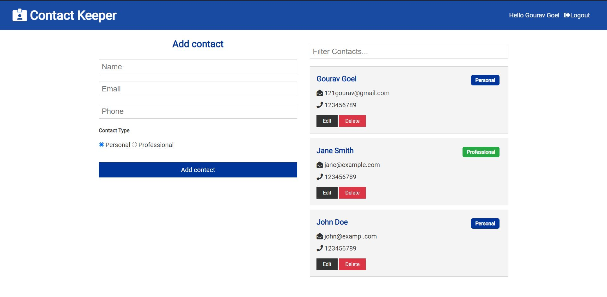

# Contact-Store

> Full stack application that stores logged in user contacts with CRUD functionality.

## Deployed Application
[Click Here](http://contact-store.herokuapp.com/)



## Tech Stack

Frontend --> 
ReactJS, context-api, axios, react-dom, react-redux, react-router-dom, react-transition-group

Backend --> 
NodeJS, ExpressJS, MongoDB, mongoose, bcryptjs, jsonwebtoken, express-async-handler

## Install Dependencies

```
npm install
```

## Run App

```
# Run in dev mode
npm run dev

# Run in prod mode
npm start
```
